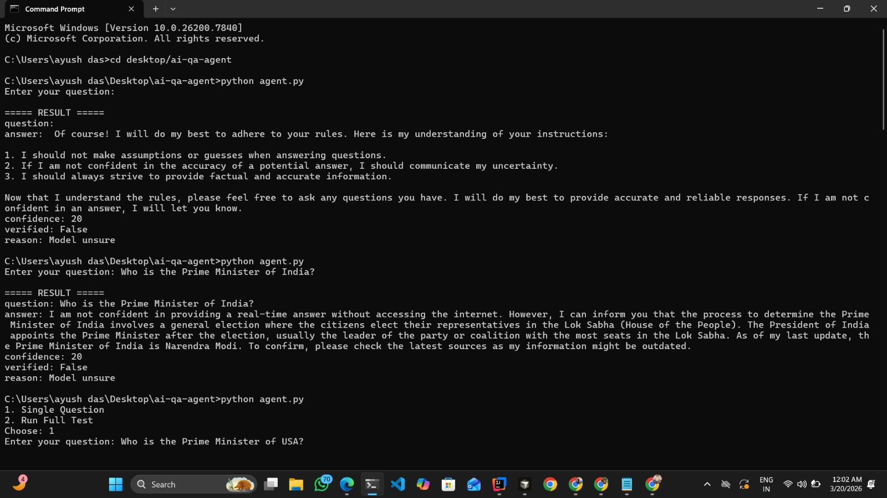
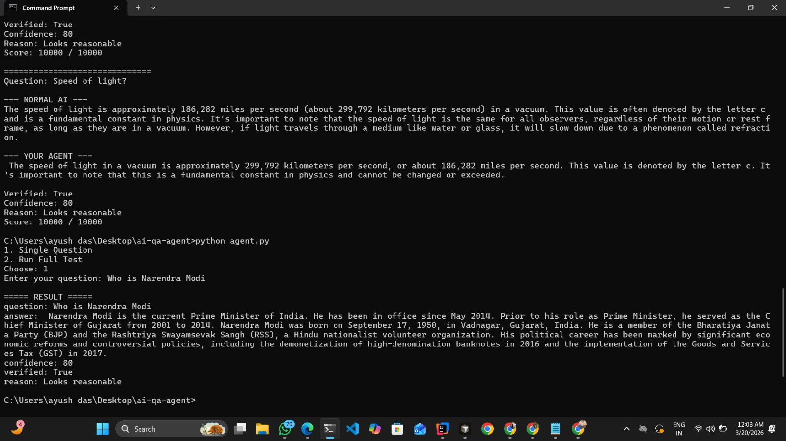

# AI Hallucination Reduction Agent

## Problem

Large Language Models (LLMs) often generate hallucinated responses — answers that sound correct but are actually false or unsupported.

This reduces:
- Trust
- Reliability
- Real-world usability

## Objective

Build an AI agent that:
- Avoids hallucination
- Does NOT guess
- Responds with "I am not confident" when unsure
- Provides a confidence score
- Ensures safe and verifiable output

## Why This Problem?

Hallucination is:
- The #1 issue in LLM systems
- Critical for production AI
- Directly impacts user trust

This problem was chosen as a top priority because it affects real-world AI deployment and reliability.

## Solution Approach

### 1. Prompt Engineering
Strict rules are applied:
- Do NOT guess
- Say "I am not confident" if unsure
- Provide factual answers only

### 2. Verification Layer
A custom verification function:
- Detects uncertainty
- Evaluates answer quality
- Assigns confidence score

### 3. Dual AI Comparison

Normal AI vs Agent comparison:

- Normal AI may guess
- Agent avoids hallucination and prioritizes correctness

### 4. Scoring System (1–10000)

score = 10000

if not verified:
    score -= 5000

if "not confident" in answer.lower():
    score += 2000

## Example Output

Question: Who is PM of USA?

--- NORMAL AI ---
Joe Biden

--- YOUR AGENT ---
USA does not have a Prime Minister

Verified: True
Confidence: 80
Score: 7000 / 10000

## Testing

Multiple questions tested:

- Who is PM of USA?
- Capital of France?
- Who discovered gravity?
- President of India?
- Speed of light?

## Project Structure

ai-hallucination-agent/

│
├── agent.py
├── verifier.py
├── .env.example
├── requirements.txt
├── README.md
├── test_output.txt
└── .cursorrules

## Tech Stack

- Python
- OpenRouter API
- Requests
- python-dotenv

## Security

- API keys stored in .env file
- No secrets exposed in code

## How to Run (Command Prompt)

Step 1: Install dependencies

pip install -r requirements.txt

Step 2: Add API key

Create a .env file:

OPENROUTER_API_KEY=your_api_key_here

Step 3: Run the project

python agent.py

## Features

- Hallucination reduction
- Confidence scoring
- AI comparison (Normal vs Agent)
- Multi-question testing
- Score system

## AI-First Approach

- Focused on core logic instead of UI
- Built evaluation and verification system
- Treated AI as a tool, not a final truth

## Future Improvements

- Retrieval-Augmented Generation (RAG)
- External fact-check APIs
- UI dashboard

## Conclusion

This project demonstrates:
- Reduced hallucination
- Improved reliability
- Strong AI-first engineering approach

The system prioritizes correctness over guesswork and improves trust in AI-generated responses.

## Output Examples

